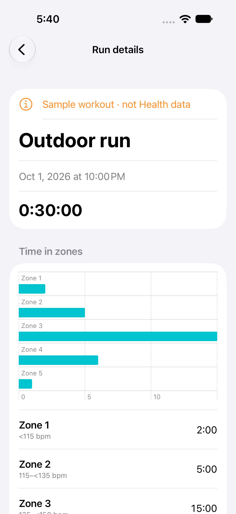
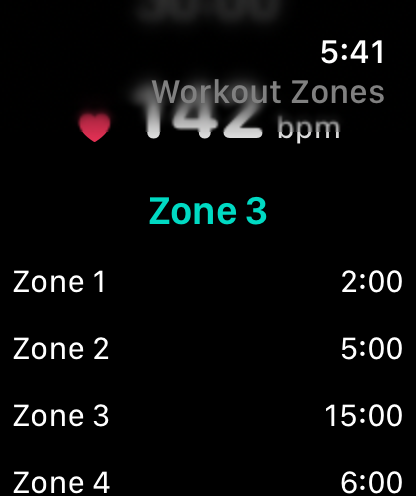

# Workout Zones

An Apple Watch outdoor-run recorder with a native iPhone history. It uses HealthKit’s workout-zone APIs to show actual heart-rate boundaries and time in each zone.

## Run the apps

Open **Workout Zones.xcodeproj** in Xcode 27. Select **Workout Zones** for iPhone or **Workout Zones Watch** for Apple Watch. Deployment targets are iOS 27 and watchOS 27. Bundle identifiers are `com.dd.workoutzones` and `com.dd.workoutzones.watchkitapp`.

For devices, choose your own development team and enable HealthKit for both identifiers. No signing identity is committed. The Watch app runs independently once installed. Start a workout explicitly to request Health permissions; **Explore preview** works without Health access and never saves a workout.

## Record and review

- Start an outdoor run on Apple Watch. The system workout session collects heart rate and supplies zone updates. Pause, resume, and explicitly save or discard the workout.
- Enable optional zone-change haptics before starting. Initial, stale, paused, and rapidly repeated updates do not trigger cues. A missing recent heart-rate sample displays a dash.
- On iPhone, connect to Health and pull to refresh after Health sync finishes. Only this app’s runs appear, with up to 100 recent records. Zone charts preserve each workout’s boundaries; unclassified time remains separate.
- If HealthKit supplies no zone configuration, the recorder stays usable and explains the missing zone data. The app does not invent age-based thresholds or training recommendations.

The recorder currently supports outdoor running, heart rate, duration, and zones. It does not record routes, distance, energy, custom training plans, or live phone mirroring. Health handles watch-to-phone record synchronization; this project does not duplicate health records through WatchConnectivity. Background workout processing is enabled. Recovery after a terminated recording process and interrupted save operations still require physical-device verification.

## Engineering

Swift 6 complete concurrency, main-actor observable state, async Health queries, session-identity guards for delayed callbacks, bounded summary validation, and an explicit workout lifecycle. Health remains the source of truth; there is no separate health database, account, analytics, or third-party dependency.

The original icon is reproducible with `swift Scripts/GenerateIcon.swift`. All preview values are labelled fixtures. Simulator checks establish the preview workflow and build compatibility, not sensor accuracy or Health synchronization.

```sh
swift test
swift test -c release
bash Scripts/test-ui.sh iOS
bash Scripts/test-ui.sh watchOS
```

See [verification](Docs/Verification.md), [privacy](PRIVACY.md), and [contributing](CONTRIBUTING.md). MIT licensed.

References: [HealthKit workout zones](https://developer.apple.com/videos/play/wwdc2026/207/), [HealthKit](https://developer.apple.com/documentation/healthkit), and [designing for watchOS](https://developer.apple.com/design/human-interface-guidelines/designing-for-watchos).

## Preview

Native simulator screenshots using sample data; these do not represent a recorded Health workout.

 
